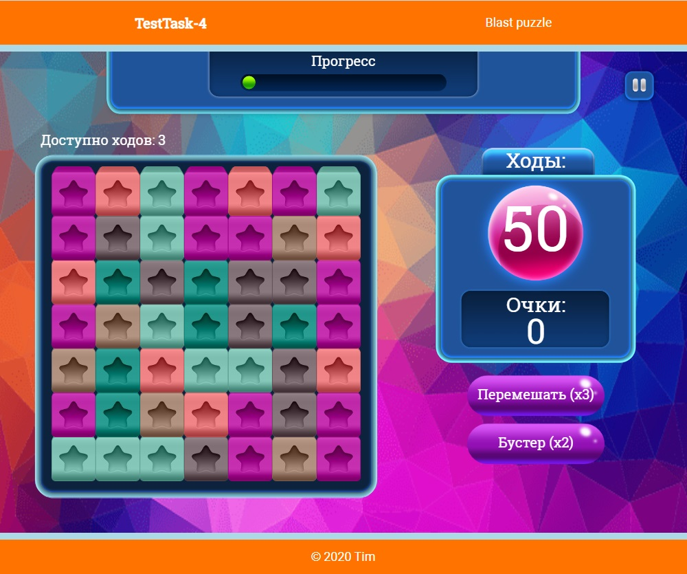

# TestTask-4

## Назначение

Тестовое задание. Август 2020.

## Актуальная версия

 - Деплой: https://jasper7466.github.io/TestTask-4/
 - Исходники: [v1.0.0](https://github.com/jasper7466/TestTask-4/tree/v1.0.0)
 
## Исходные данные для разработки

Реализовать прототип игры-головоломки по типу "три в ряд" с механикой Blast
- Параметры игры (размер поля, количество вариаций тайлов, минимальная группа тайлов для удаления) - произвольные
- Перемещения тайлов по игровому полю должны быть анимированы
- Должны быть обработаны ситуации выигрыша и проигрыша по очкам/ходам
- Для UI игры должен быть использован предложенный набор ассетов
- Исходники выложить на github.com

## Краткое описание

Проект представляет собой одностраничный web-сайт с игровым экраном. Пользовательский интерфейс реализован на JS + HTML5 Canvas. сторонние библиотеки и фреймворки не использовались.

На экране отображаются:
- верхняя панель с полосой прогресса
- кнопка "Пауза"
- количество доступных вариантов хода
- игровое поле с тайлами
- панель отображения оставшихся ходов и набранных очков
- кнопка "Перемешать поле"
- кнопка "Бустер"

**Демонстрация работы (gif):**

 

## Как развернуть проект

Проект собирается с помощью статического модульного сборщика Webpack.

Установка плагинов осуществляется через [Node Package Manager (NPM)](https://nodejs.org/en/download/).

Версии пакетов и их зависимостей зафиксированы в файлах `package.json` и `package-lock.json`, поэтому для автоматической установки достаточно выполнить команду `npm install` в корневой директории проекта.

В конфигурационном файле настроены три варианта запуска сборки проекта:

 - **npm run build** - компиляция. Проект собирается локально, продукты сборки сохряняются в указанной директории (в моём случае это "./dist").
 - **npm run dev** - отладка. Проект запускается на локальном сервере с автоматической "горячей" пересборкой и перезагрузкой при внесении изменений в исходные коды.
 - **npm run deploy** - релиз. Проект собирается и публикуется в ветку "gh-pages" указанного репозитория.

## Утилиты

### Random.mjs

Содержит утилиту `RandomIntInclusive(min, max)`, которая генерирует случайное целое число в диапазоне от `min` до `max`.

### Animations.mjs

Содержит анимационные функции, которые можно передавать в качестве коллбеков в очереди параллельного (ParallelQueue) и последовательного (SerialQueue) выполнения у визуальных компонентов (наследники класса BaseComponent).

На каждой итерации вызова коллбек-функция получает ссылку на сущность, к которой она применена и, соответственно, доступ ко всем её свойствам и методам.

### AsyncImageLoader.mjs

Утилита для асинхронной загрузки изображений. На вход получает ссылку на изображение. На выход отдаёт промис, из которого в последствии можно будет получить экземпляр класса `Image` при успешном разрешении.

### AsyncImageToner.mjs

**Зависимости:** `RandomIntInclusive`, `AsyncImageLoader`

Содержит две утилиты:

`AsyncImageToner` - для асинхронного изменения тона изображения. На вход получает ссылку на изображение и значения декрементов RGB-составляющих. На выход отдаёт промис, из которого в последствии можно будет получить экземпляр класса `Image` при успешном разрешении.

Требование к изображению: для достижения адекватного эффекта - оно должно быть "обесцвечено" (приведено в градации серого), т.к. алгоритм перекраски делает декремент RGB-составляющих попиксельным проходом.

`AsyncRandomRepaint` - утилита для получения набора перекрашенных спрайтов. На вход принимает изображение-образец, количество варианетов цвета, диапазон перекраски (от 0 до 255).

### TileFactory.mjs

Зависисмости: `BaseComponent`

Утилита для создания сущностей "тайл". На вход принимает массив спрайтов и индекс. На выходе отдаёт сущности объект "тайл" класса BaseComponent.

## Классы

### BaseComponent.mjs

Класс базового компонента. Реализует все основные свойства и методы, присущие большинству логических/визуальных элементов.

**Свойства:**

`_ctx` - текущий контекст

`_x`, `_y` - координаты по осям X и Y

`_dx`, `_dy` - координаты точки отрисовки с учётом точки привязки (anchor)

`_width`, `_height` - ширина и высота

`_anchorX`, `_anchorY` - относительное положение точки привязки (относительно ширины и высоты)

`_background` - фоновое изображение

`_alpha` - прозрачность компонента

`_borders` - объект с координатами границ (не используется)

`_hitbox` - объект с относительными границами зоны хитбокса по каждой из сторон компонента

`_clickHandler`, `_pressHandler`, `_releaseHandler`, `_hoverHandler`, `_hoverInHandler`, `_hoverOutHandler`, `_removeHandler` - коллбеки-обработчики одноимённых событий

`_isPressed`, `_isHovered` - флаги состояний "press" и "hover"

`_eEnabled` - флаг разрешения событий

`_serialTaskQueue`, `_parallelTaskQueue` - массивы коллбеков последовательного и параллельного выполнения

**Методы:**

`setContext(ctx)` - установка контекста

`setPosition(x, y)` - установка положения по обеим осям

`setX(value)` - установка положения по оси X

`setY(value)` - установка положения по оси Y

`setSize(width, height)` - установка размера

`setAnchor(x, y)` - установки якоря

`setHitbox(left, right, top, bottom)` - установка хитбокса

`setClickHandler(callback)` - установка обработчика события клика

`setRemoveHandler(callback)` - установка обработчика события удаления

`setHoverInHandler(callback)` - установка обработчика события входа курсора в зону хитбокса

`setHoverOutHandler(callback)` - установка обработчика события выхода курсора из зоны хитбокса

`setHoverHandler(callback)` - установка обработчика события нахождения курсора в зоне хитбокса

`setPressHandler(callback)` - установка обработчика события нажатия

`setReleaseHandler(callback)` - установка обработчика события отпускания

`setBackgroundImage(img)` - установка фонового изображения

`getSize()` - получение размера

`getPosition()` - получение текущего положения

`getSerialQueueSize()` - получение размера очереди последовательного выполнения

`getParallelQueueSize()` - получение размера очереди параллельного выполнения

`resizeOnBackground()` - изменение размера под фоновое изображение

`scaleOnBackground(factor)` - пропорциональное изменение размера относительно размера фонового изображения

`scaleOnBackgroundWidth(width)` - пропорциональное изменение размера относительно размера фонового изображения под заданную ширину

`scaleOnBackgroundHeight(height)` - пропорциональное изменение размера относительно размера фонового изображения под заданную высоту

`_refresh()` - пересчёт при изменении зависимых параметров

`_isHit(x, y)` - проверка нахождения координат внутри хитбокса компонета

`onPress(x, y)` - обработчик события "нажатие"

`onRelease(x, y)` - обработчик события "отпускание"

`onMove(x, y)` - обработчик события "движение мыши"

`_onClick()` - обработчик события "клик"

`onRemove()` - обработчик события удаления компонента

`addParallelTask(callback)` - добавление коллбек-функции в очередь параллельного выполнения

`addSerialTask(callback)` - добавление коллбек-функции в очередь последовательного выполнения

`disableEvents()` - запрет событий

`enableEvents()` - разрешение событий

`render()` - отрисовка

### Grid.mjs

**Наследование:** `BaseComponent` -> `Grid`

Класс, реализующий сетку-контейнер для сущностей типа `BaseComponent` или его потомков.

### Label.mjs

**Наследование:** `BaseComponent` -> `Label`

Класс, реализующий метку для вывода текста.

### Button.mjs

**Наследование:** `BaseComponent` -> `Label` -> `Button`

Класс, реализующий кнопку.

### ToggleButton.mjs

**Наследование:** `BaseComponent` -> `Label` -> `Button` -> `ToggleButton`

Класс, реализующий кнопку c фиксацией.

### ProgressBar.mjs

**Наследование:** `BaseComponent` -> `ProgressBar`

Класс, реализующий полосу прогресса со скруглёнными краями.

В качестве спрайтов для фона и полосы - достаточно передать изображения шириной в 1px и произвольной высоты.

### Screen.mjs

Класс, реализующий экран отрисовки и движок.

### BlastEngine.mjs

Класс, реализующий экран игровую логику.

## Технологии

 - HTML5 Canvas
 - JS
 - CSS
 - Git
 - Webpack

## Известные проблемы и что можно улучшить

- Ответственность за игровую логику сильно размазана между классом BlastEngine и функцией игрового цикла gameLoop()
- Валидация входных данных выполняется далеко не во всех методах
- Хитбокс у компонента может быть только прямоугольной формы
- В некоторых местах рассчёт параметров выполняется на каждой итерации отрисовки вместо того, чтобы хранить значения и пресчитывать их только в момент обновления зависимых параметров
- Не реализована такая полезная абстракция как "Контейнер". Поэтому все компоненты спозиционированы абсолютно
- Не реализована адаптивность интерфейса
- Не реализована механика слоёв и перекрытия элементов друг-другом. Например, событие "click" сработает на всех компонетах, в чей зоне хитбокса оно было вызвано, независимо от перекрытия.
- Не реализовна механика софт-рестарта. Для перезапуска игры нужно обновлять страницу
- В контейнере-сетке Grid после большого рефакторинга не восстановлен функционал корректного позиционирования тайлов при размерах сетки отличных от N x N
- В некоторых геттерах наружу отдаются внутренние объекты в чистом виде. Также на эту "особенность" завязаны некоторые механики смежных алгоритмов. Отдаваемые объекты должны являться глубокими копиями исходных
- Есть участки кода, где происходит обращение к свойствам объекта напрямую (в т.ч. к приватным). Нужно переделать всё под геттеры/сеттеры
- Принято допущение, что движок работает со скоростью 60 FPS, что не всегда может быть обеспечено. Желательно реализовать передачу в рендер-функции интервала времени, прошедшего с последнего кадра, чтобы соблюдались тайминги работы анимаций и прочих коллбеков
- Игровой баланс. Формула рассчёта очков достаточно примитивна. В идеале, там должны учитываться такие составляющие как: размер сетки, вариативность тайлов, минимальная группа, минимальная супер-группа, количество бустеров, максимальное количество ходов, количество очков для победы.